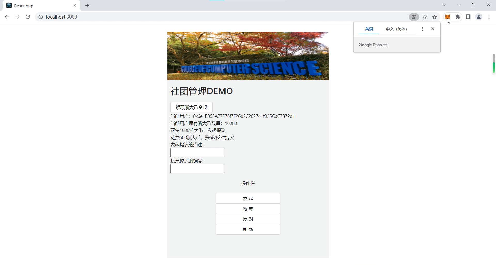
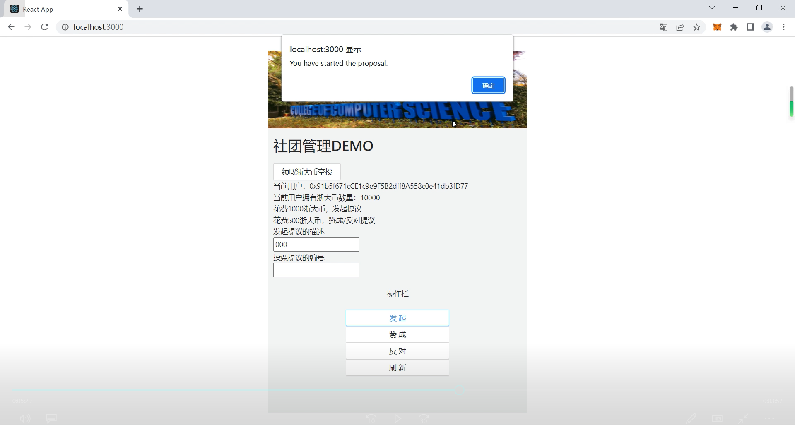
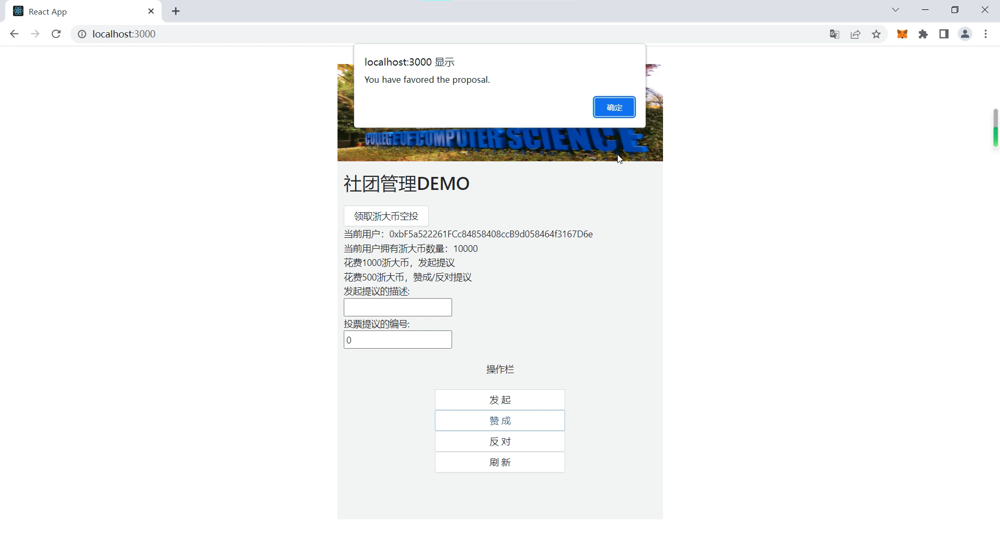
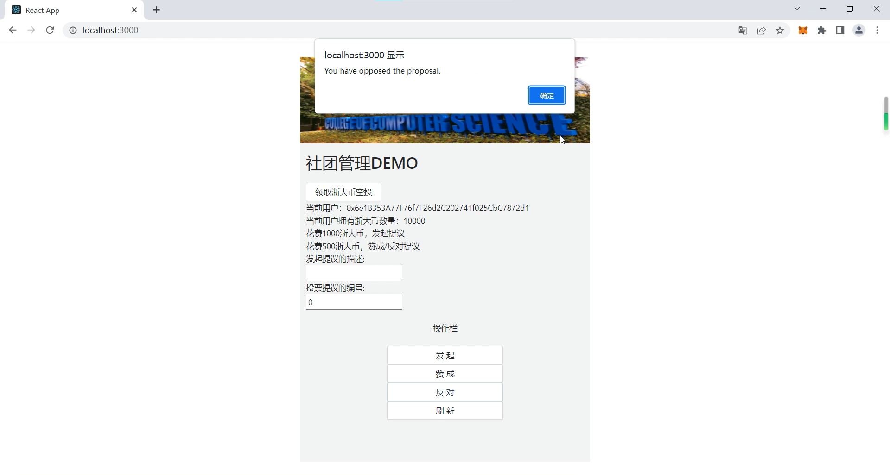
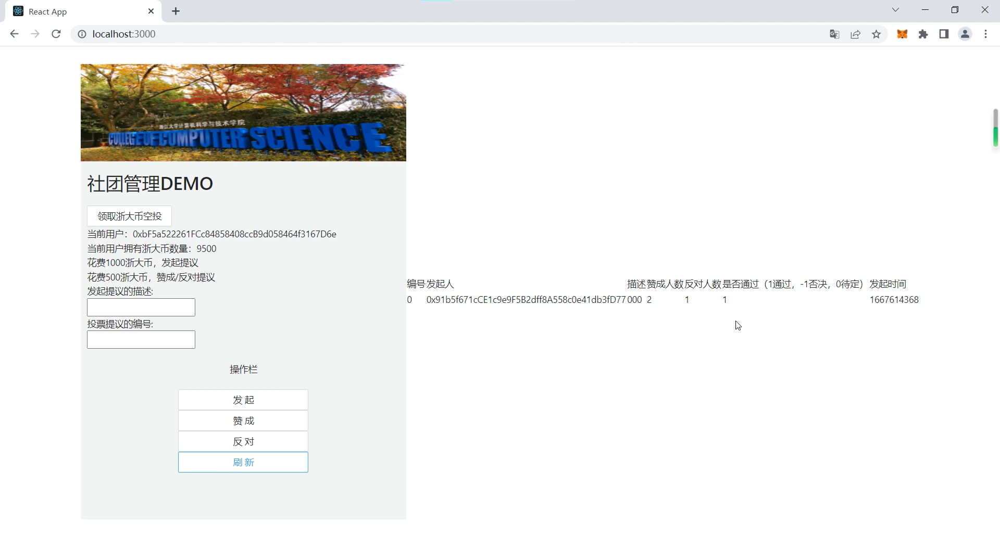

# ZJU-blockchain-course-2022

> 第二次作业要求（可以删除）：
>
> 去中心化学生社团组织治理应用
>
> - 每个学生初始可以拥有或领取一些通证积分（ERC20）。
> - 每个学生可以在应用中可以：
>    1. 使用一定数量通证积分，发起关于该社团进行活动或制定规则的提案（Proposal）。
>    2. 提案发起后一定支出时间内，使用一定数量通证积分可以对提案进行投票（赞成或反对，限制投票次数），投票行为被记录到区块链上。
>    3. 提案投票时间截止后，赞成数大于反对数的提案通过，提案发起者作为贡献者可以领取一定的积分奖励。

## 如何运行

1. 在本地启动ganache应用。

2. 在 `./contracts` 中安装需要的依赖，运行如下的命令：
    ```bash
    npm install
    ```
3. 在 `./contracts` 中编译合约，运行如下的命令：
    ```bash
    npx hardhat compile
    ```
4. 在 `./contracts` 中部署合约，修改hardhat.config.ts网络配置后运行如下的命令：
    ```bash
    npx hardhat run scripts/deploy.ts
    ```
5. 修改前端合约地址，配置chrome中metamask的账户

6. 在 `./frontend` 中启动前端程序，运行如下的命令：
    ```bash
    npm start
    ```

## 功能实现分析

项目实现了通过区块链与智能合约完成社团的投票管理功能。提供给用户的前端功能有：

1.连接metamask钱包。

2.获取一定数量的初始浙大币（即通证积分），用于投票（此处设置为10000）。

3.花费一定浙大币（此处设置为1000），发起一项新的提案。发起者需要填入一定的描述。

4.花费一定浙大币（此处设置为500），赞成或反对一项已有的提案。投票者需要填入提案编号，且必须在投票时间内（方便演示，此处设置为1min）。每人每提案限投1次。

5.刷新提案的状态并在网页前端打印。超过投票时间的提案会被结束，赞成数大于反对数的提案通过，发起者奖励一定的浙大币（此处设置为1000+500）。

合约后端实现如下：

1.数据结构

除去发起额、投票额等相关参数的设置，合约实现了proposal结构记录所有的提案

```bash
struct Proposal {
        address starter;      //发起人地址
        string des;           //描述
        uint numf;            //赞成人数
        uint numo;            //反对人数
        int pass;             //1代表通过，-1代表不通过，0代表还在审核
        uint time;            //发起时间
        address[] favor;      //赞成者地址
        address[] oppose;     //反对者地址
}
Proposal[] public proposals;
```

合约初始化时，会新建一个继承自ERC20的myERC20对象，用于委托转账。此外为方便演示，会往合约列表中放入一个测试用合约

2.领取初始浙大币

检查用户是否领取过初始浙大币。若没有，通过ERC20的_uint的方法铸造10000个浙大币

3.发起提案

接口要求提供提案描述，往proposals中插入一个提案

```bash
function start(string memory des) public
```

用户点击前端按钮时，网页调用onstart函数。前端检查连接已建立、描述已输入后，调用ERC20的approve方法，委托合约1000浙大币，然后调用合约start函数，转账500浙大币并将提案加入proposals

4.赞成/反对提案

接口要求提供提案编号，往proposals中编号相同的提案加入赞成/反对

```bash
function canvote(address a,uint num) public view returns (bool)
function p_favor(uint num) public
function p_oppose(uint num) public
```

其中canvote函数输入投票者地址与提案编号。函数查看提案是否结束，然后遍历proposals[num].favor与proposals[num].oppose查看是否已投票决定是否可投票。
p_favor函数输入提案编号。函数调用canvote检查是否可投票，然后转账合约，并将调用者地址计入合约赞成列表。p_oppose同理，投反对票。

用户点击前端按钮时，网页调用onfavor/onoppose函数。前端检查连接已建立、编号已输入后，调用合约canvote方法检查。通过后调用ERC20的approve方法，委托合约500浙大币，然后调用合约p_favor/p_oppose函数，转账500浙大币并记录赞成/反对提案

5.刷新

接口结束所有超时提案，返回所有提案信息

```bash
function refresh() public
function get() public returns(Proposal[] memory)
```

函数refresh遍历提案列表，结束超时提案并奖励通过提案的发起者。函数get向前端返回提案信息，简单起见未作加密与多余信息截取。
由于solidity执行更新需要消耗gas，利用脚本定时触发存在账户balance耗尽的问题。此处采取了一种变相的定时刷新机制，即由用户刷新并支付gas。当用户数量较多时，几乎可以保证随时刷新，用户间的gas支付也能相对公平。

## 项目运行截图

启动并导入账户

发起提案

赞成提案

反对提案

刷新结果


## 参考内容

课程的参考Demo见：[DEMOs](https://github.com/LBruyne/blockchain-course-demos)。
